# 🚛 ETL Pipeline Case Study – State Road Transport Data

> A case study on building a complete **ETL pipeline** using multi-format government transport datasets with cloud storage integration and Tableau visualization.

---

## 📁 Data Sources

The data was sourced from the [Government of India Open Data Portal](https://data.gov.in/) and includes:

- 📄 **CSV**: Profit and Loss data  
- 🧾 **JSON**: Financial performance data  
- 🗂 **XML**: Physical data of SRTUs  

All datasets are hypothetically stored in **Google Drive** (cloud storage).

---

## 🔁 ETL Process Overview

```mermaid
graph TD
    A[📥 Extract] --> B[🛠 Transform]
    B --> C[📤 Load]
```

    
## ✅ Extract

- Collected **CSV**, **JSON**, and **XML** files from the cloud (Google Drive).
- Formats include both **structured** and **semi-structured** data.

---

## 🔧 Transform

- Unified data using **Python (Colab)**:
  - Standardized column names and values
  - Cleaned and merged datasets across formats

---

## 🚀 Load

- Final transformed data uploaded back to **Google Drive**.
- Ready for consumption in analytics platforms.

---

---

## 🧰 Tech Stack

- 🐍 **Python (Google Colab)**
- 📦 `pandas`, `lxml`, `json` for data processing
- ☁️ **Google Drive** (Cloud Storage)

---

## **FURTHER IMPROVEMENTS**
### 📊 How to Visualize in Tableau **FURTHER IMPROVEMENTS**

1. Open Tableau → Connect → To a Server → **Google Drive**
2. Sign in to your Google Account
3. Allow access to Tableau
4. Select the uploaded dataset
5. Begin building visual dashboards!

---

## 📎 Files Included

- `Case Study.ipynb`: Python code for the full ETL pipeline  
- `final_data.xlsx`: Final cleaned and merged dataset  
- `Day 4 Case Study.docx`: Detailed write-up and methodology  

---

## 🤝 Credits

This project is a part of a **learning initiative** and showcases how to handle **multi-format ETL workflows** with real-world datasets.

---

## 📌 License

This case study is for **educational purposes only**.

